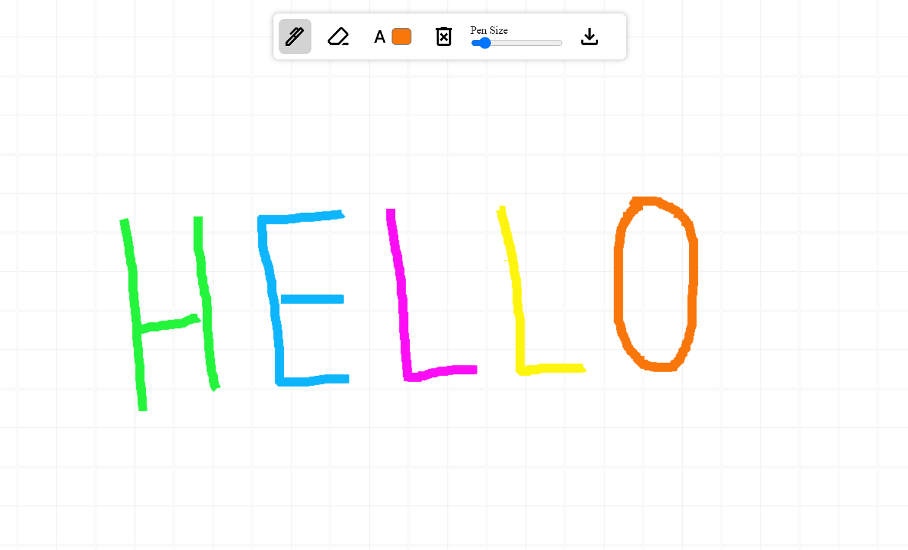

# Drawing App
Welcome to the Drawing App – a simple yet versatile application for unleashing your creativity! This app, developed using HTML, CSS, and Vanilla JavaScript with HTML canvas, allows you to draw, erase, customize your tools, and more.

## Preview


## Features
1. **Draw with a Pen:** Express your artistic side by drawing freely with the pen tool.
2. **Erase with Precision:** Correct or modify your drawings using the eraser tool.
3. **Clear Canvas in a Click:** Start fresh with a clean canvas by clearing all drawings in a single click.
4. **Adjust Pen and Eraser Size:** Customize your drawing experience by adjusting the size of both the pen and eraser.
5. **Choose Pen Color:** Add vibrancy to your drawings by selecting different colors for your pen.
6. **Download Your Masterpiece:** Save your creations by downloading the canvas as an image.

## Local Setup
- Pull this branch into your local system.
- Make sure you have Node installed (preferrably Node v18.17.1).
- Navigate to the project directory and run
```
npm install
```
- Once all the dependencies have been installed, run the following command to build the project.
```
npm run build
```
- Spin up the local server with the following command.
```
npm run start
```
- Copy the `url` from the console. Open the browser and go to the following url.
```
{url}/index.html
```